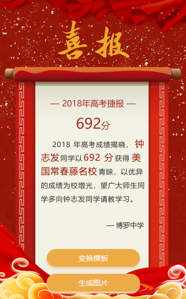

# CanvasText
Canvas文本绘制插件
## 效果预览

## 使用方法
1. 引入js文件，如：  
``<script src="./../CanvasText.js"></script>``
2. 创建一个新对象,如：  
``var main = new CanvasText();``
3. 获取canvas元素，并创建2d模型，如：  
``var canvas = document.getElementById('canvas');``  
``var ctx = canvas.getContext('2d');``
4. 使用
## 功能介绍
### 绘制居中的单一文本  
```
main.drawCenter(ctx, {
  content: '— 2018年高考捷报 —',
  style: '34px Bold SimSun',
  color: '#ab322a',
  y: 430
});
```  
需要传入两个参数，分别为`canvas容器`和`配置参数`，配置参数分为：内容、文本样式、文本颜色、相对Y轴坐标
### 绘制单行居中的复杂文本
```
main.SingleCenterByComplex(ctx, {
  content: [
    {text: score, style: '58px Bold SimSun', color: '#ab322a'},
    {text: '分', style: '36px Bold SimSun'}
  ],
  y: 520
});
```
需要传入两个参数，分别为`canvas容器`和`配置参数`，配置参数分为：内容数组（包含文本、文本样式、[文本颜色])、相对Y轴坐标
### 绘制多行居中的复杂文本
```
main.MultiLineByComplex(ctx, {
  content: [
    {text: '2018年高考成绩揭晓，', style: '28px Bold SimSun'},
    {text: ''+ sessionStorage.name +'', style: '36px Bold SimSun', color: '#9c180a'},
    {text: ' 同学以 ', style: '28px Bold SimSun'},
    {text: ''+ score +'分 ', style: '36px Bold SimSun', color: '#9c180a'},
    {text: '获得', style: '28px Bold SimSun'},
    {text: ''+ titleList[title].text +' ', style: '36px Bold SimSun', color: '#9c180a'},
    {text: ''+ titleList[title].textEnd +'，以优异的成绩为校增光，望广大师生同学多向'+ sessionStorage.name +'同学请教学习。', style: '28px Bold SimSun'}
  ],
  y: 594,
  width: 420,
  lianHeght: 55,
  textIndent: true
});
```
需要传入两个参数，分别为`canvas容器`和`配置参数`，配置参数分为：内容数组（包含文本、文本样式、文本颜色)、相对Y轴坐标、总宽度、行高、是否首行缩进
### 绘制单行的方向对齐文本
```
main.SingleByDirection(ctx, {
  direction: 'right',
  x: 170,
  y: 500,
  text: '— '+ 广东财经大学 +'',
  style: '28px Bold SimSun',
  color: '#333333'
});
```
需要传入两个参数，分别为`canvas容器`和`配置参数`，配置参数分为：对齐方向（left或right）、距离左侧距离，距离顶部距离、内容、文本样式、文本颜色
## 兼容性
ie9+
## 预览地址
[预览地址](https://zhongzhifa.github.io/CanvasText/)
